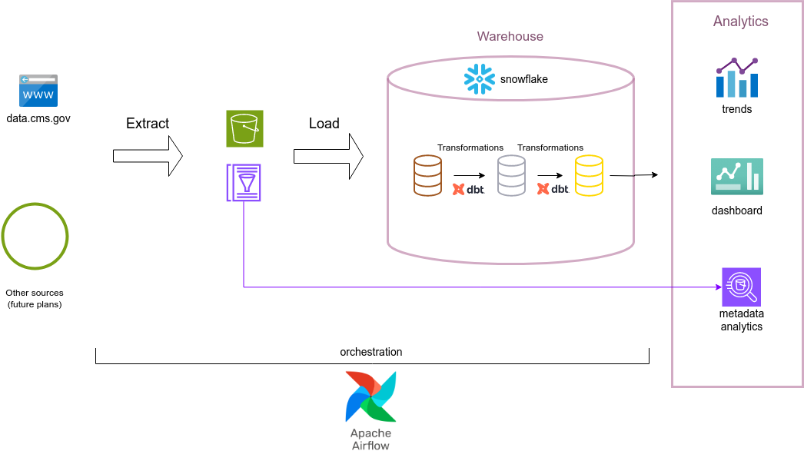

# Medicare Data Engineering Pipeline

A data engineering project focused on processing and analyzing synthetic Medicare data files.

## Project Overview

This project implements an ELT (Extract, Load, Transform) pipeline for Medicare healthcare data from cms.gov to a data warehouse to enable advanced transformations and analytics on the data.

## Project Objectives

- Design and implement full data pipeline, from extracting raw data to analytically available high-grade data
- Gain experience with data tools such as Airflow, Snowflake, and DBT
- Implement advanced queries on the data to draw meaningful conclusions, both in healthcare and business-oriented questions


## Optional Technical Goals
- Implement data streaming for real-time data processing

## Analytical Goals
- Analyze demographic trends in Medicare patient population
   - Age distribution
   - Optional: Location distribution
- Identify health-related trends in the population
   - Common chronic conditions
   - Optional: Healthcare utilization patterns
- Business-oriented analysis
   - Cost and spending analysis
   - Prescription drug analysis
   - Optional: Fraud detection and analysis (if streaming is implemented)

## Data Pipeline Architecture




## Data Pipeline: ELT Approach

### Extract and Catalog

- Source: Synthetic Medicare files from CMS.gov
- Process: Automated download via Airflow
- Validation: File integrity and structure verification
- intermediate storage: Local filesystem
- Destination: AWS S3 data lake
- Cataloging: AWS Glue for schema discovery
  
### Load
- Platform: Snowflake
- Approach: Batch loading from S3
- Schema creation - columns names translation
- Goals: Efficient data loading, schema consistency, data quality checks
  
### Transform
- Platform: Snowflake with dbt
- Approach: SQL-based transformations
- Goals: Data quality checks, schema consistency, analytics-ready tables
  
  
### Core Technologies

**Apache Airflow** - orchestrates the workflows. It offers robust scheduling with Python flexibility and AWS integration, ideal for managing complex task dependencies.

**AWS S3** - serves as data lake. It is cost-effective for large datasets, has seamless integration with AWS services, and strong durability guarantees for the raw data.

**AWS Glue** - handles cataloging and ETL operations with reduced overhead due to its serverless architecture, while automatically discovering schemas and efficiently converting Medicare CSV files to Parquet format.

**Parquet Format** - optimizes the raw data storage by providing 2-4x better query performance through columnar storage, reducing storage costs with compression, and enabling partition pruning for faster loading to the data warehouse.

**Snowflake** - Data warehouse that enables:
- Separation of storage and compute for optimal cost management
- Auto-suspension capabilities that reduce costs by ~40% compared to always-on solutions
- Superior performance for complex analytical queries on healthcare data
- Simple workload isolation that supports concurrent analyst and data scientist access

**dbt (data build tool)** - powers the transformations due to its SQL-based approach that simplifies development, built-in testing for data quality, and automated documentation for Medicare data lineage.


## Data Files

The project works with synthetic Medicare data files from CMS that simulate real-world healthcare data:

### Beneficiary Data

- **Content**: Patient demographic and enrollment information
- **Time span**: Multiple yearly snapshots (2015-2025)
- **Format**: CSV files with patient identifiers
- **Scale**: ~185 columns per file, thousands of rows per year
- **Key information**: Demographics, eligibility periods, coverage details

### Claims Data

Contains medical service claims across different healthcare settings:

| File | Description | Key Contents |
|------|-------------|--------------|
| `carrier.csv` | Professional services | Office visits, procedures |
| `inpatient.csv` | Hospital inpatient | Admissions, diagnoses, procedures |
| `outpatient.csv` | Hospital outpatient | ER visits, same-day services |
| `dme.csv` | Durable Medical Equipment | Medical supplies and equipment |
| `hha.csv` | Home Health Agency | Home-based care services |
| `hospice.csv` | Hospice | End-of-life care |
| `snf.csv` | Skilled Nursing Facility | Post-acute nursing care |

### Prescription Drug Data

- **File**: `pde.csv` (Prescription Drug Events)
- **Content**: Detailed medication dispensing records
- **Key fields**: Drug identifiers, pharmacy data, costs, prescriber information
- **Relations**: Links to beneficiary data via patient identifiers

## Data Model

### Core Entities

1. **Beneficiary**
   - Demographics (age, gender, race)
   - Geographic information (state, county, zip)
   - Enrollment periods and coverage details

2. **Claims**
   - Service details by provider type
   - Diagnosis and procedure codes
   - Payment information and cost sharing

3. **Prescription Drugs**
   - Drug identifiers (NDC codes)
   - Dispensing details (quantity, days supply)
   - Cost breakdown (patient/insurance portions)
   - Prescriber and pharmacy information

## Getting Started

### Prerequisites

- Python 3.8+
- AWS account with S3 and Glue access
- Airflow environment
- 1GB+ storage for data files

### Installation

Clone the repository
```bash
git clone https://github.com/lshunak/medicare_data_project.git
cd medicare_data_project
```
Create and activate a virtual environment
```bash
python -m venv venv
source venv/bin/activate
```
Install dependencies
```bash
pip install -r requirements.txt
